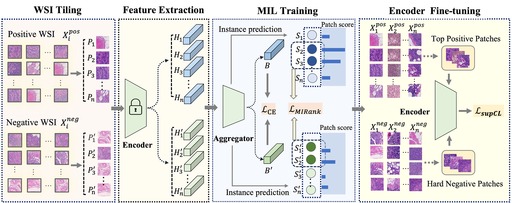

## HNM-WSI
* This repository contains the implementation for our work "Hard Negative Sample Mining for Whole Slide Image Classification", accepted by MICCAI 2024



### Environment Setup

Follow these steps to setup the environment

1. **Install Conda**: Ensure that you have Conda installed on your system. If not, you can download it from [Miniconda](https://docs.conda.io/en/latest/miniconda.html) or [Anaconda](https://www.anaconda.com/products/individual) based on your preference.

2. **Create Conda Environment**: Navigate to the project's root directory in your terminal or command prompt. Then, use the following command to create a Conda environment from the `environment.yml` file:

    ```bash
    conda env create -f environment.yml
    ```

### Dataset

* Camelyon16 whole slide image and TCGA mutation whole slide image were downloaded from [Camelyon16](https://camelyon16.grand-challenge.org/Data/) and [TCGA Portal](https://portal.gdc.cancer.gov/projects/TCGA-LUAD), respectively.

#### Camelyon16 dataset

* We adopt the same method as [DSMIL](https://github.com/binli123/dsmil-wsi) for data preprocessing. For more details about the threshold for filtering the background patches, please refer to the original paper.

#### TCGA mutation dataset

*  Same as the [Its2CLR](https://arxiv.org/abs/2210.09452), we preprocessed the data using the [DeepPath](https://github.com/ncoudray/DeepPATH) method.

### Pseudo label generation before training

* Before training the model, you need to generate the initial patch-level prediction scores. I use the instance classifier of the [DSMIL](https://github.com/binli123/dsmil-wsi) to generate the patch-level prediction scores.

### Training and evaluation

* To train the model on your dataset, you can use the following command:

```bash
CUDA_VISIBLE_DEVICES=0 python run.py  \
--expname EXP_NAME \
--threshold 0.3 \
--gpuid 0 \
--augment_transform 0 \
--batch_size 512 \
--pretrain_weight  \ #SSL pretrain weight path
--model_save_root  \ 
--pseudo_label_path /checkpoints/ssl/simclr/checkpoint/ins_pseudo_label_train.p \ #Initial pseudo label path, from the MIL trained on feature extractor using SSL pretrain weight
--MIL_every_n_epochs 5 \
--epoch_to_extract_mil 199 \
--posi_batch_ratio 0.2 \
--ro 0.2 \
--ro_neg 0.2 \
--rT 0.8 \
--warmup 5 \
--init_MIL_training yes \
--negfilter yes \
--neg_ratio 0.2 \
--root_dir xxxx \ # /single
--labelroot xxxx \ # /single
--comet_api_key xxxxx \
```